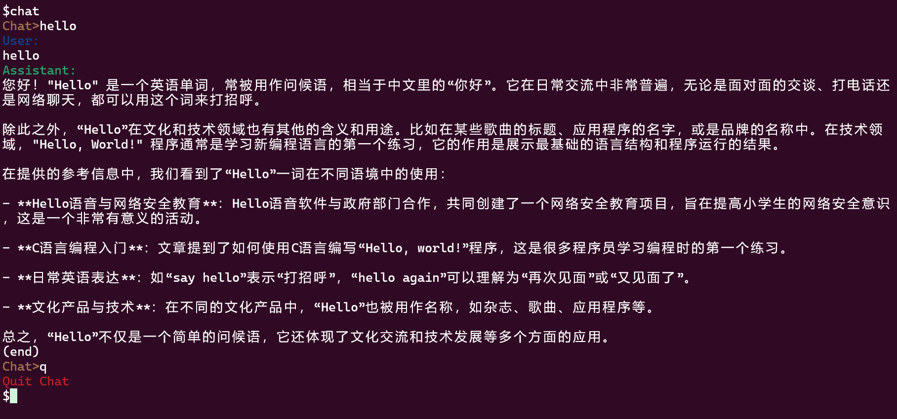
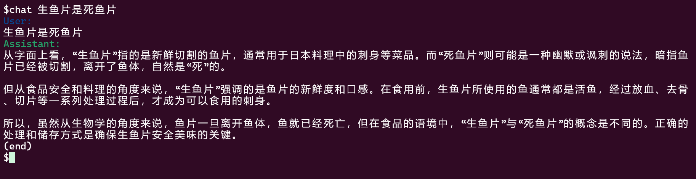

# GLM_SHELL


## 项目简介

基于GLM API，实现将GLM-4集成到Ubuntun终端。

## 功能特点

- 安装简单：提供shell脚本，输入API即可完成集成过程。
- 方便使用：在命令行即可与GLM模型进行多轮和单轮对话。

## 安装指南

### 系统要求

- Python 3.7 或更高版本
- zhupuai，colorama等相关库

### 安装步骤

1. 在官网注册，获取api_key

   [智谱AI开放平台 (bigmodel.cn)](https://open.bigmodel.cn/)

2. 安装zhipuai，colorama库

   ```sh
   pip install zhipuai
   pip install colorama
   ```

3. 克隆项目到本地

   ```sh
   mkdir glm_shell
   git clone <address>

4. 进入项目目录：

   ```sh
   cd glm_shell
   ```

5. 运行shell脚本

   ```sh
   sudo bash create_chat.sh
   ```

6. 输入合法的GLM API

## 使用方法

### 命令行接口

```sh
chat <your input>
```

1. 无参数：进入多轮对话模式，输入q退出
2. 有参数：进入单轮对话模式

## 示例

1. 多轮对话

   

2. 单轮对话

   

## 许可证

本项目遵循MIT许可证。

## 联系我

如有问题或建议，请通过以下方式联系我：

- 邮箱：221300043@smail.nju.edu.cn
- GitHub：https://github.com/CyberZz-del/glm_shell

---